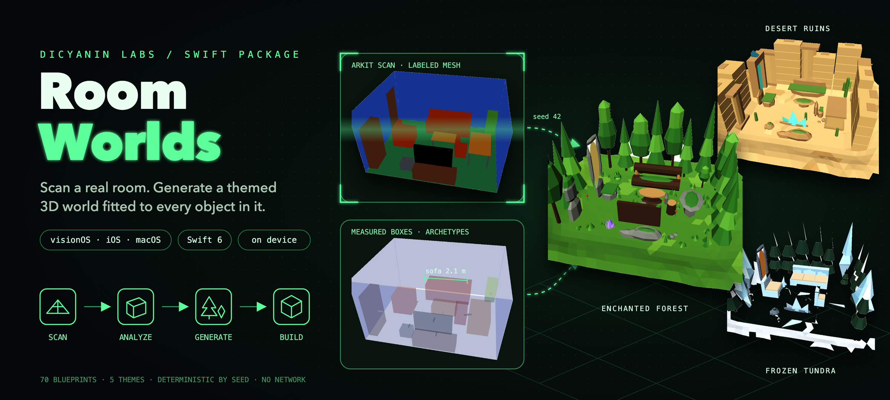
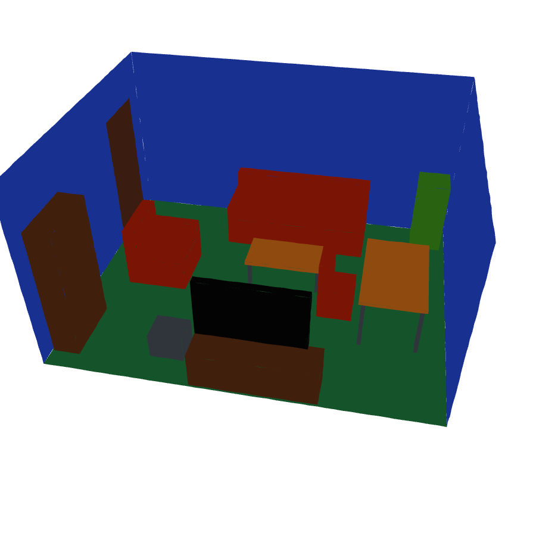
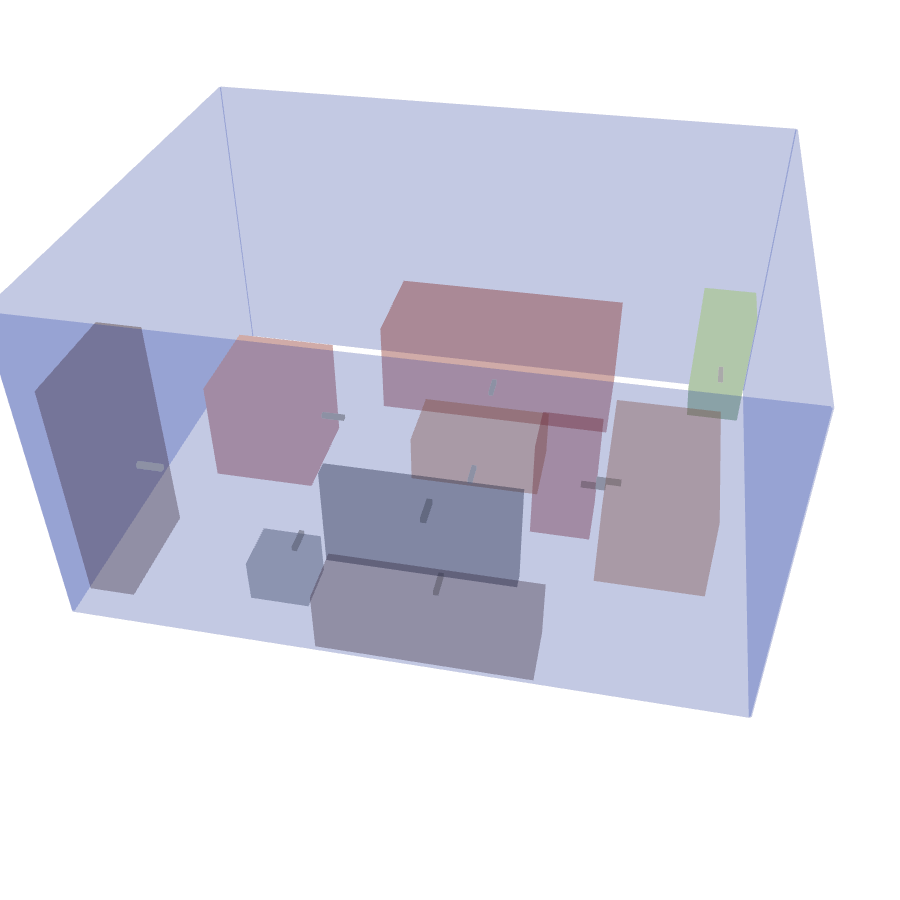
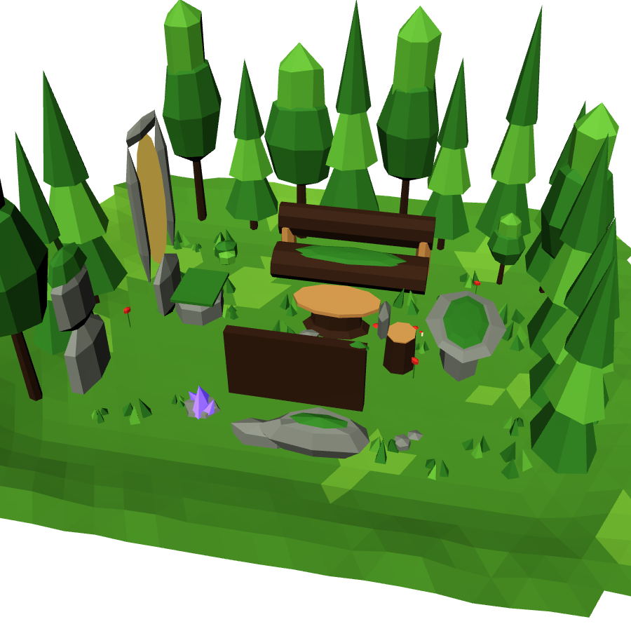
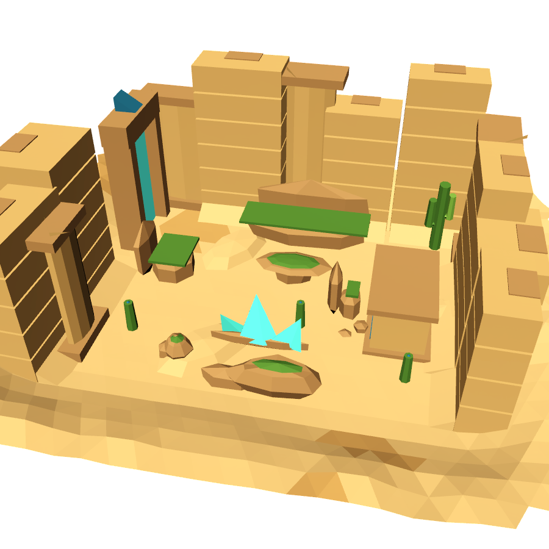
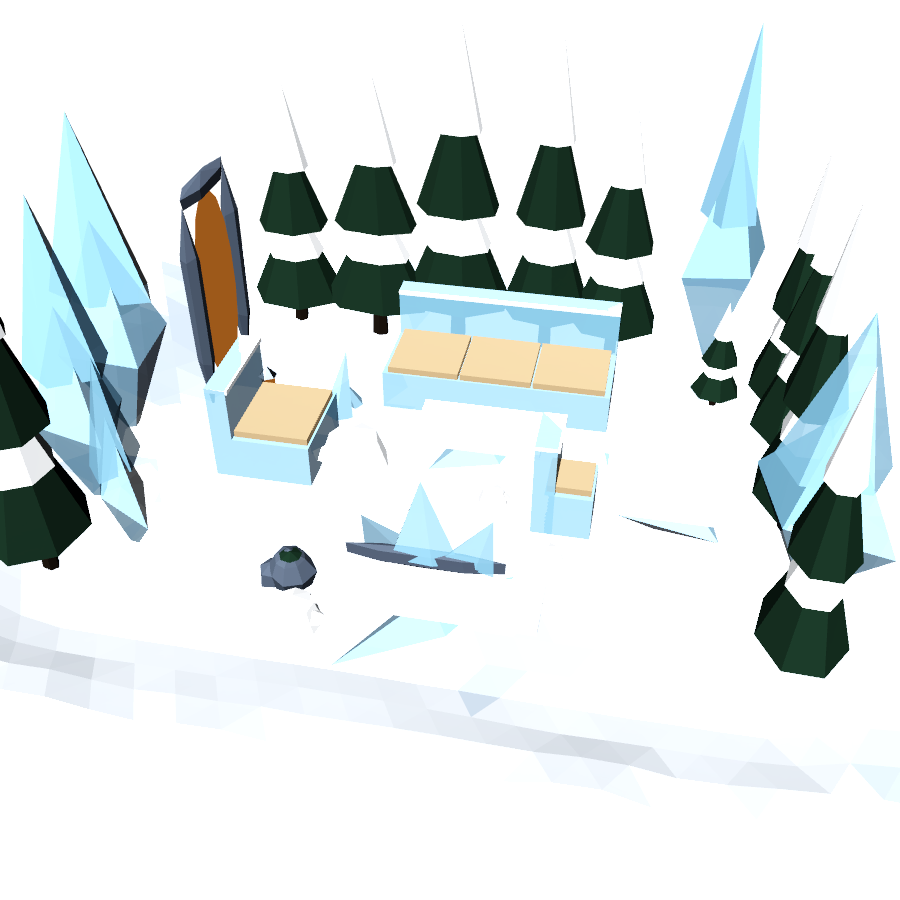
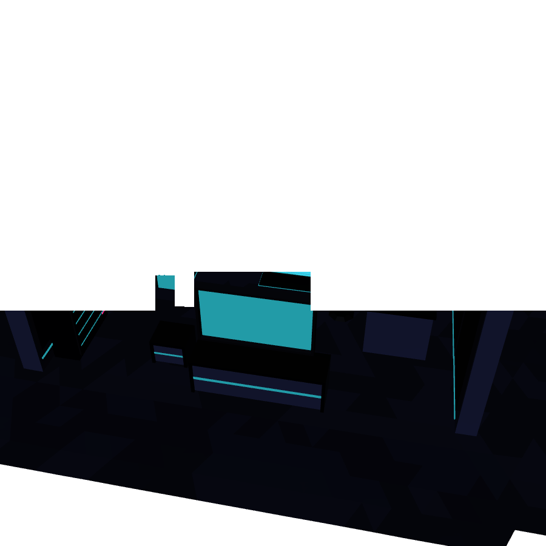

# DicyaninRoomWorlds



[](https://github.com/hunterh37/DicyaninRoomWorlds/actions/workflows/ci.yml)


[](LICENSE)

Scan a room on Vision Pro (or a LiDAR iPhone), then generate a themed 3D world from it on device. Every couch, table, bed and shelf is measured, classified and replaced by a stylized asset fitted to its real size, seat height and facing direction. Walls become tree lines, cliffs or tech panels; doors and windows become portals; the floor becomes terrain. No network, no LLM, deterministic by seed.

| Scan (ARKit labels) | Analysis | Cozy |
|---|---|---|
|  |  |  |

| Enchanted Forest | Desert Ruins | Frozen Tundra |
|---|---|---|
|  |  |  |

Neon City: 

## Features

| Area | Feature | API | Platforms |
|---|---|---|---|
| Scan | Scene reconstruction with classification, plane detection, room tracking | `RoomScanner` | visionOS |
| Scan | Live labeled mesh preview and coverage meter | `scanner.previewRoot`, `ScanCoverage` | visionOS |
| Scan | Import iPhone/iPad LiDAR meshes | `RoomScan(meshAnchors:)` | iOS |
| Scan | Synthetic living room for tests and the simulator | `SyntheticRoom`, `scanner.loadSynthetic()` | all |
| Analysis | Floor and ceiling height, Manhattan axis | `RoomAnalyzer` | all |
| Analysis | Walls, windows and doors | `RoomModel.walls`, `.openings` | all |
| Analysis | Measured boxes with 19 archetypes (sofa, bed, desk, shelf, tv, plant...) | `room.objects(_:)` | all |
| Analysis | Floor occupancy grid with clearance, A* and spawn points | `room.grid` | all |
| Generation | 70 parametric low-poly blueprints fitted to measured size, seat height and facing | `AssetLibrary`, `AssetBlueprint` | all |
| Generation | 5 themes: cozy, enchanted forest, neon city, desert ruins, frozen tundra | `WorldTheme` | all |
| Generation | Boundary pieces, door and window portals, terrain, Poisson-disk decor scatter | `WorldGenerator` | all |
| Generation | Deterministic by seed, Codable JSON output for save and share | `WorldSpec` | all |
| RealityKit | Entity tree in the ARKit world frame, sun, optional sky | `WorldEntityBuilder` | all |
| RealityKit | ECS components linking each entity to its real object and surface height | `RoomWorldComponent`, `WorldSurfaceComponent` | all |
| RealityKit | Box colliders, optional static physics bodies, floor collider | `Options.collisions`, `.physicsBodies` | all |
| RealityKit | Decor batched per 2.5 m tile, unlit mode | `Options.batchDecor`, `.chunkSize`, `.unlit` | all |
| Extensibility | Custom blueprints and themes registered at runtime | `lib.register(_:)` | all |

- visionOS 2+, iOS 18+, macOS 15+ (analysis, generation and RealityKit building run everywhere; scanning is visionOS)
- swift-tools 6.0, strict concurrency, no dependencies
- 34 tests on a synthetic, rotated, noisy room, labeled and unlabeled (`swift test`)

## Installation

Swift Package Manager:

```swift
dependencies: [
    .package(url: "https://github.com/hunterh37/DicyaninRoomWorlds.git", from: "1.1.0")
],
targets: [
    .target(name: "MyApp", dependencies: ["DicyaninRoomWorlds"])
]
```

Xcode: File > Add Package Dependencies, enter `https://github.com/hunterh37/DicyaninRoomWorlds.git`.

visionOS apps that scan need `NSWorldSensingUsageDescription` in Info.plist and an `ImmersiveSpace` (ARKit data providers run only while an immersive space is open).

## Pipeline

```
RoomScanner (ARKit)  ->  RoomScan  ->  RoomAnalyzer  ->  RoomModel  ->  WorldGenerator  ->  WorldSpec  ->  WorldEntityBuilder  ->  Entity
 visionOS only           Codable       pure Swift        Codable        pure Swift          Codable        RealityKit
```

`RoomScan` is raw labeled triangles. `RoomModel` is structured room understanding: floor and ceiling height, Manhattan axis, walls, windows, doors, measured objects with archetypes, and a floor occupancy grid with clearance, A* and spawn points. `WorldSpec` is a small JSON list of placed assets (blueprint ID, size, yaw, seed); meshes are rebuilt from it on demand, so worlds can be saved and shared.

## Quick start (visionOS)

```swift
import DicyaninRoomWorlds

@MainActor @Observable final class WorldModel {
    let scanner = RoomScanner()          // or RoomScanner(session: sharedARKitSession)
    var world: Entity?

    func scan() async { await scanner.start() }   // add scanner.previewRoot to your RealityView

    func build(theme: WorldTheme = .enchantedForest) async throws {
        guard scanner.coverage.isSufficient else { return }
        let spec = await scanner.makeWorld(theme: theme, seed: 42)   // analysis runs off the main actor
        scanner.stop()
        world = try WorldEntityBuilder.build(spec)
    }
}
```

In an `ImmersiveSpace`, add `world` with an identity transform: entities are in the ARKit world frame, so the world lines up with the real room. Use `.mixed` immersion with the default options (no sky) for an overlay on passthrough, or `.full` with `options.includeSky = true` to replace the room.

Simulator: `SceneReconstructionProvider` is unsupported there. Call `scanner.loadSynthetic()` to get a sample living room.

iPhone/iPad LiDAR: run `ARWorldTrackingConfiguration` with `sceneReconstruction = .meshWithClassification`, then `RoomScan(meshAnchors: frame.anchors.compactMap { $0 as? ARMeshAnchor })`. Plain `.mesh` (no classification) also works: the analyzer infers floor, ceiling and walls from geometry and classifies objects by shape.

## Pure Swift use (any platform, tests, servers)

```swift
let scan = try RoomScan.decode(savedData)                 // or SyntheticRoom.scan()
let room = RoomAnalyzer().analyze(scan)
room.objects(.sofa).first?.box.size                       // measured width, height, depth
room.grid.path(from: a, to: b, radius: 0.25, smooth: true) // walkable path around real furniture
let spec = WorldGenerator().generate(room: room, theme: .desertRuins, seed: 7)
let json = try spec.encoded()
```

## Games

- Every entity carries `RoomWorldComponent` (role, blueprint, `sourceID` of the real object, archetype). Furniture stand-ins carry `WorldSurfaceComponent` with the real seat or table-top height.
- Furniture and boundary pieces get static box colliders sized to the real objects (`Options.collisions`, `physicsBodies`), and the terrain gets a floor collider.
- `spec.spawnPoints` are farthest-point samples on walkable floor. `room.grid.isWalkable`, `clearance(at:)` and `path(from:to:smooth:)` handle NPC movement around real furniture.
- Object, wall and opening IDs come from kind and position, so a rescan that adds one object keeps every other stand-in, variant and seed.
- Decor is batched into one mesh per 2.5 m tile. The sample living room builds to 80 to 125 submeshes and under 5k triangles per theme; analysis of a 95k-triangle scan takes about 50 ms (release, M-series Mac).

## Assets

70 parametric low-poly blueprints across five themes. A blueprint is a list of parts; each part edge is an affine function of the measured box:

```
value = base(min | max | center | surface) + fraction * extent + offset
```

So a table top is `y: Span(.surf(-0.045), .surf())` (always 4.5 cm thick, always at the measured top) and a leg is `x: .fromLo(0.06, inset: 0.05)` (always 6 cm wide). Count-adaptive `RepeatRule`s add cushions, drawers, shelves and doors as the object grows. Size conditions drop backrests and headboards when the scan shows none.

```swift
var lib = AssetLibrary.standard
lib.register(AssetBlueprint("table.mushroom", tags: ["table"], size: [1, 0.75, 1], parts: [
    PartSpec(.cyl(8, taper: 0.8), .trim, x: .centeredFraction(0.3), y: Span(.lo(), .surf(-0.1)), z: .centeredFraction(0.3)),
    PartSpec(.dome(segments: 10), .accent, y: Span(.surf(-0.12), .surf())),
]))
var theme = WorldTheme.enchantedForest
theme.furniture[.diningTable] = ["table.mushroom"]
lib.register(theme)
let spec = WorldGenerator(library: lib).generate(room: room, theme: theme)
```

Themes: `cozy` (faithful restyle for passthrough overlay), `forest`, `neon`, `desert`, `tundra`. A theme is a palette (material role to color, roughness, metallic, emission), an archetype to blueprint map, boundary pieces and spacing, door and window pieces, decor scatter rules, terrain style and sky.

## Algorithms

Formulas, parameters and references: [docs/ALGORITHMS.md](docs/ALGORITHMS.md).

## Layout

| Path | Contents |
|---|---|
| `Scan/` | `SurfaceLabel`, `RoomScan`, `ScanCoverage`, `SyntheticRoom` |
| `Analysis/` | frame estimation, voxel segmentation, wall and opening extraction, box fitting, archetype classifier, floor grid and A* |
| `Geometry/` | seeded RNG and noise, 2D geometry, primitives, `MeshData` |
| `Assets/` | blueprint DSL, built-in blueprints and themes, `AssetLibrary` |
| `World/` | `WorldGenerator`, `WorldSpec`, terrain, Poisson-disk scatter |
| `RealityKit/` | `WorldEntityBuilder`, sun and sky, scan preview |
| `Platform/` | `RoomScanner` (visionOS), ARKit mesh and plane conversion (visionOS, iOS) |

The hero image composites these screenshots with vector art. Screenshots are rendered offscreen by the `RoomWorldsGallery` target in [DicyaninPackages/RenderGallery](https://github.com/hunterh37/DicyaninPackages).

## License

MIT. See [LICENSE](LICENSE). Changes: [CHANGELOG.md](CHANGELOG.md).
